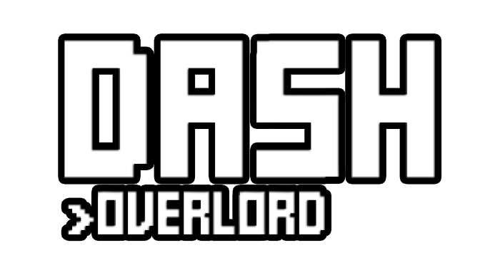

# Dash OVERLORD : Created by Bogdan2D

### Dash OVERLORD is a game developed in 1 week for HaxeJam 2021.

### Go play it [here](https://www.newgrounds.com/portal/view/project/1769892)!

# Compiling

Hey!
So, to compile the game you need a file called SecretHA.hx.
I git ignored it because it contains secret info about the newgrounds version of the game.
To fix this, just create a new file called SecretHA.hx in the source folder, and type the following :

```haxe
package;

class SecretHA
{
	public static var ID:String = "";
	public static var ENC_KEY:String = "";
}

```

Also, you will need to have the following libraries installed :

```
flixel
flixel-addons
flixel-ui
hscript
lime
newgrounds
openfl
```

Sorry if i missed a lot of info. I suck at explaining things xD
